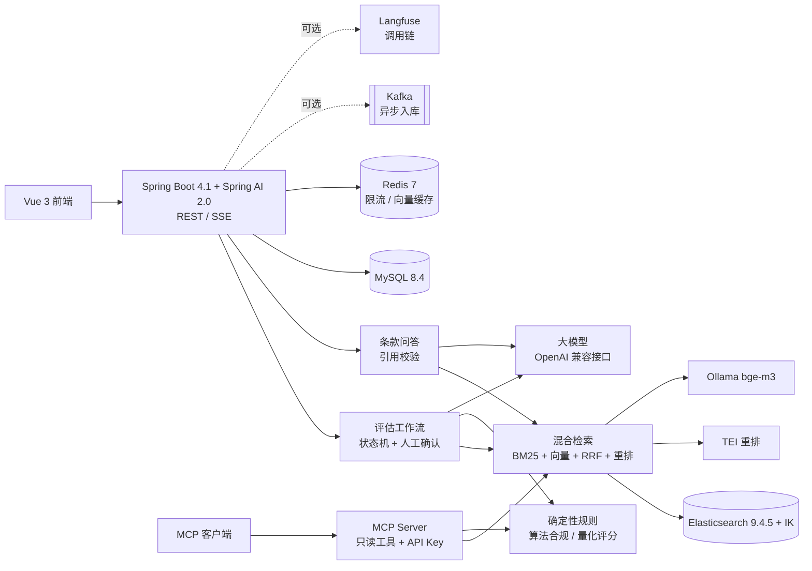

# 密评智能助手（crypto-assess-agent）

面向 **商用密码应用安全性评估（密评）** 的 RAG + Agent 辅助自查工具：条款级检索问答、被测系统差距分析、量化评分和 Word 报告草稿。

> 定位是辅助自查与学习工具。页面、报告中的判定和得分都是 **辅助自查草稿，需测评人员确认** ，不能替代商用密码检测机构出具的正式测评报告。

## 功能

| 功能 | 说明 |
| --- | --- |
| 标准入库 | 规范化 Markdown → 条款切分（编号、章节路径、安全层面、适用等级）→ MySQL + Elasticsearch；按内容哈希幂等；可选 Kafka 异步入库（重试 + 死信） |
| 条款检索 | BM25（IK 分词）、向量（bge-m3）、混合（应用层 RRF）、混合 + 重排（bge-reranker-v2-m3）四种模式，返回各阶段名次、分数与耗时 |
| 条款问答 | 检索增强生成，SSE 流式输出；引用精确到条款并校验，无效引用不显示为有效来源；检索置信度低时拒答 |
| 评估工作流 | 评估项目 → 测评对象与密码措施 → 要求匹配 → 算法合规规则检查 → 结构化判定（JSON Schema 校验）→ 人工复核 → 量化评分 → 报告草稿；每步落库，失败或重启后从剩余步骤继续 |
| 确定性规则 | 算法合规规则表与量化评分规则都是 YAML，结论只来自规则；评分按《商用密码应用安全性评估量化评估规则（2023 版）》（D/A/K、测评单元权重、技术 70 + 管理 30）；规则判为不合规的算法，模型不能判为“A 满足” |
| MCP Server | 4 个只读工具（search_clauses、get_clause、check_algorithm、compute_score），API Key + scope 授权，调用写审计日志 |
| 工程化 | Redis 令牌桶限流（Lua）、向量缓存、Micrometer Tracing → Langfuse、按单价表统计模型费用 |
| 评测 | 检索、问答（三组对比）、差距识别（纯提示词 vs 工作流）、评分一致性、全量总报告 |

## 架构



技术栈：Java 21、Spring Boot 4.1、Spring AI 2.0、MyBatis、Flyway、Elasticsearch 9.4.5 + IK、Ollama、TEI、Kafka 4、Redis 7、Apache POI、Vue 3 + TypeScript + Element Plus。设计取舍见 `docs/decisions.md`，任务进度见 `docs/PROGRESS.md`。

## 快速开始

### 1. 准备

- JDK 21（必须是 JDK，只有 JRE 时编译会报 `release version 21 not supported`）
- Docker（WSL2 下注意 `vm.max_map_count ≥ 262144`，Elasticsearch 需要）
- Node.js 24（前端）
- poppler-utils（`pdftotext`，只有做语料规范化时需要）
- 内存：core profile 约 6–8 GB

### 2. 启动依赖

```bash
cp -n .env.example .env        # 至少填写 MYSQL_PASSWORD；要用问答/判定再填 LLM_*
docker compose --env-file .env -f deploy/compose.yaml --profile core up -d
docker compose --env-file .env -f deploy/compose.yaml exec ollama ollama pull bge-m3
```

`tei-rerank` 首次启动会从 Hugging Face 下载 `BAAI/bge-reranker-v2-m3`（约 2.3 GB）。网络不通时可以先把模型下载到 `tei-data` 卷，再在 `.env` 里把 `TEI_MODEL_ID` 设为卷内快照目录离线启动，见 `deploy/compose.yaml` 的注释。

### 3. 启动应用

```bash
./mvnw spring-boot:run -Dspring-boot.run.profiles=local
curl -s 127.0.0.1:8080/api/health     # 各依赖状态；未配置 LLM_API_KEY 时 llm-config 为 DOWN，整体 503
```

### 4. 导入标准并建索引

标准原文不在仓库里。按 `docs/实施计划.md` 的 T02 把标准转成规范化 Markdown 放进 `data/normalized/`，或者先用自带的仿标准样例体验（启动时设 `KB_NORMALIZED_DIR=data/fixtures`）。导入和重建索引需要 admin scope 的 API Key（`.env` 中的 `MCP_API_KEYS`，如 `ops:<至少12位的密钥>:admin`）：

```bash
curl -s -X POST 127.0.0.1:8080/api/kb/documents -H 'X-API-Key: <密钥>' \
     -H 'Content-Type: application/json' -d '{"fileName":"mock-standard.md"}'
curl -s -X POST 127.0.0.1:8080/api/kb/reindex -H 'X-API-Key: <密钥>'
```

### 5. 前端

```bash
npm --prefix frontend ci && npm --prefix frontend run dev    # http://127.0.0.1:5173，/api 代理到 8080
```

页面包括：条款问答、检索调试、评估项目。

### 6. MCP 接入（可选）

```bash
npx @modelcontextprotocol/inspector      # Streamable HTTP，URL http://127.0.0.1:8080/mcp，请求头 X-API-Key
claude mcp add --transport http crypto-assess http://127.0.0.1:8080/mcp --header "X-API-Key: <密钥>"
```

密钥需要 `kb:read`（检索、取条款）或 `rules:read`（算法检查、评分）scope。

## 测试与评测

```bash
./mvnw -q verify                                   # 单元测试 + Testcontainers 集成测试（测试不调用真实模型）
npm --prefix frontend run test && npm --prefix frontend run build
./mvnw spring-boot:run -Dspring-boot.run.profiles=eval -Dspring-boot.run.arguments="--eval.suite=retrieval --eval.dataset=v1"
./mvnw spring-boot:run -Dspring-boot.run.profiles=eval -Dspring-boot.run.arguments="--eval.suite=summary --eval.dataset=v1"
```

评测套件：`retrieval`、`qa`、`gap`、`scoring`、`summary`；工具：`--eval.tool=annotate`（检索标注）、`--eval.tool=validate`（评测集校验）。每次运行写入新目录 `eval/results/<UTC 时间戳>-<suite>/`（report.md、metrics.json、cases.jsonl），目录已存在就报错，失败的运行也会保留。

### 评测结果

| 评测 | 数据集 | 指标 | 报告 |
| --- | --- | --- | --- |
| （尚无正式结果） | | | |

正式评测需要仓库所有者完成的数据：规范化标准、检索评测集、题库抽样、模拟被测系统与预期差距项、规则表与评分规则核对。没测出来的数字不写；每个数字都要能指向 `eval/results/` 下的一份报告。

## 限制

- 判定依赖录入的密码措施描述，不做真实设备检测（如抓包验证 TLS 套件）。
- 评分规则 `scoring.v2` 与算法规则 `algorithms.v2` 已由仓库所有者核对；量化评估规则中的高风险项尚未建模；技术组或管理组整组不适用时不出总分，转人工判断。
- 题库问答评测只使用本地 Ollama 模型（默认 qwen2.5:3b），题库不外发；其准确率不代表外部大模型的问答效果。
- 规则约束依赖模型在判定中列出相关算法，模型漏列时约束不会触发；所有判定都需要人工复核后才能进入评分。
- CPU 上的交叉编码器重排较慢（本机实测 30 条约 16 秒）。
- 检索、问答、评估接口没有鉴权，只适合本机使用；MCP 与管理接口需要 API Key。

## 数据与合规

标准原文、考核题库及其派生数据只放在 `data/raw/`、`data/private/`、`data/normalized/`（git 忽略），不进仓库；测试只使用 `data/fixtures/` 下自己编写的仿标准样例。题库相关的评测输出只记录题号和对错。
