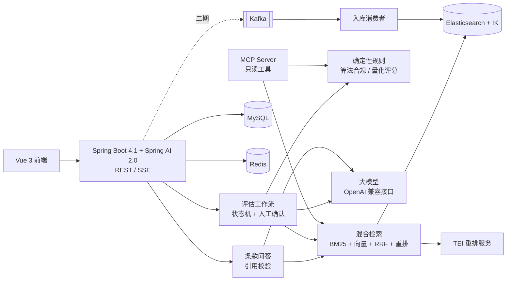
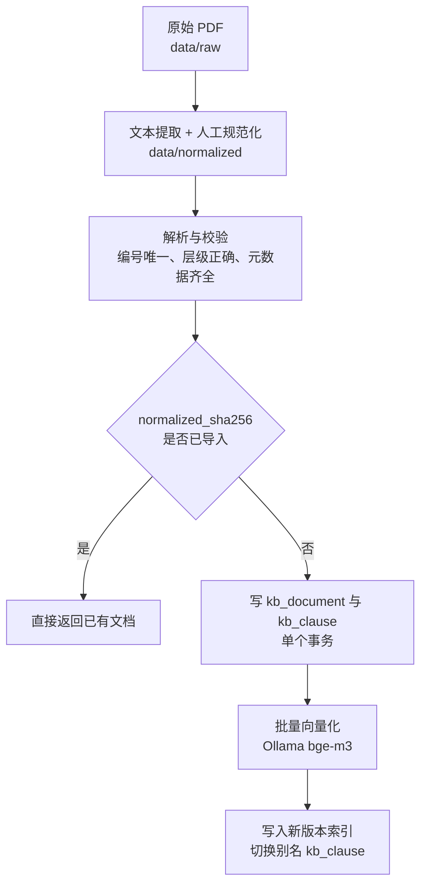
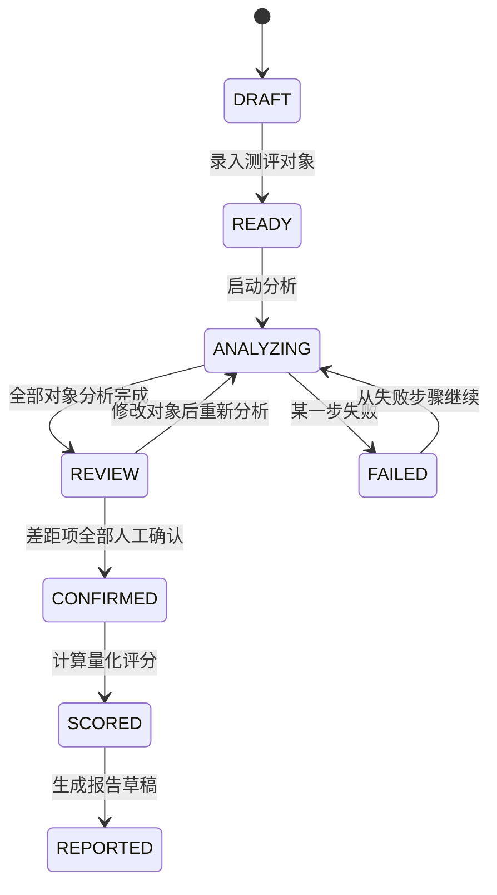

# 密评智能助手 开发计划

版本 v1.0 · 2026-09-24 · 仓库名 `crypto-assess-agent` · 执行方式见 `docs/实施计划.md`

## 1. 项目概述

**一句话**：面向商用密码应用安全性评估（密评）的 RAG + Agent 辅助系统，回答三个问题：这个系统的密码应用是否合规、差在哪里、大概能得多少分。

**定位**：辅助自查与学习工具，输出“自查草稿”，结论由测评人员确认。不替代商用密码检测机构出具的正式测评报告。

**目标用户**

- 系统运营方的安全、运维人员：上线前或年度评估前自查
- 密评从业人员：查条款、核对要求、整理差距清单

**业务依据**：《关键信息基础设施商用密码使用管理规定》自 2025-08-01 施行，要求关键信息基础设施在规划阶段和运行前开展密评，运行中每年至少评估一次，需求每年都会发生。

**非目标**

- 不出具正式测评结论，不做测评机构的业务流程管理
- 不做真实设备的密码检测（如抓包验证 TLS 套件）
- 不训练或微调模型

## 2. 需求范围

### 2.1 一期 MVP（截至 10/18）

| 编号 | 需求 | 验收要点 |
| --- | --- | --- |
| F1 | 标准入库：规范化 Markdown → 条款切分 → MySQL + Elasticsearch | 核心标准全部条款入库；抽查 50 条，条款号、章节路径、安全层面、适用等级全部正确 |
| F2 | 条款检索：BM25、向量、混合（RRF）、混合 + 重排四种模式 | 同一接口切换模式；返回每个阶段的名次和分数 |
| F3 | 条款问答：检索增强生成，SSE 流式输出，引用精确到条款并校验 | 无效引用不会显示为有效来源；检索置信度低时明确拒答 |
| F4 | 检索评测：约 150 条自标注查询，四种模式对比 | 输出 Recall@5、MRR、nDCG@10 |
| F5 | 问答评测：官方考核参考题库抽样约 200 题，三组对比 | 输出准确率、引用有效率、P95 延迟、token 用量 |
| F6 | 前端：检索调试页、问答页 | 可以完整演示 F2、F3 |

### 2.2 二期（截至 11/22）

| 编号 | 需求 | 验收要点 |
| --- | --- | --- |
| F7 | 评估项目与测评对象管理 | 录入被测系统、等级、测评对象及其密码措施 |
| F8 | 评估工作流：要求匹配 → 算法合规检查 → 结构化判定 → 差距清单 → 人工确认 | 每步落库、可单步重跑、进程重启后可继续 |
| F9 | 量化评分：按现行量化评估规则计算对象、层面与总分 | 与手算用例完全一致 |
| F10 | 差距识别评测：10–15 个模拟被测系统 | 输出召回率、误报率，并与纯提示词方案对比 |
| F11 | Word 报告草稿导出 | 含差距清单、整改建议、条款引用、得分和免责声明 |
| F12 | MCP Server：只读工具 + 鉴权 + 审计 | MCP 客户端可调用；未授权请求返回 401 |
| F13 | Kafka 异步入库、Redis 限流与缓存、Langfuse 调用链追踪 | 重复消息不重复入库；超限返回 429；每次模型调用可追踪耗时和 token |

### 2.3 非功能需求

| 类别 | 目标 |
| --- | --- |
| 性能 | 混合检索（不含重排）P95 ≤ 300 ms；重排和问答耗时单独记录，写进评测报告 |
| 可靠性 | 入库按内容 SHA256 幂等；工作流每步落库，失败后从最后一个成功步骤继续 |
| 安全 | 密钥只放 `.env`；MCP 与管理接口需要鉴权；工具调用写审计日志；日志不含原文和密钥 |
| 成本 | 开发和评测用 Flash 档模型；每轮评测的 token 与费用写进报告 |
| 合规 | 标准原文、考核题库及其派生数据不进仓库 |

## 3. 系统架构



**设计原则**

1. **大模型只做理解和表达**：算法合规和评分由 `rules` 包里的纯函数计算；大模型负责理解系统描述、抽取信息、组织文字。
2. **结论可追溯**：每条判定关联条款、证据和规则命中记录；每次模型调用记录提示词版本、模型、耗时和 token。
3. **失败要显式**：外部依赖不可用时返回明确错误，不静默降级、不隐藏重试。
4. **按单机规模设计**：单体应用、按功能分包；二期引入 Kafka 只用于入库这一条异步链路。

### 3.1 模块划分

| 包 | 职责 | 关键类 |
| --- | --- | --- |
| `common` | 配置、错误、审计、限流、模型调用记录 | `LlmCallRecorder`、`RateLimiter`、`AuditService` |
| `knowledge` | 规范化文本解析、条款切分、入库、索引 | `NormalizedStandardParser`、`KnowledgeIngestService`、`ClauseIndexer` |
| `retrieval` | 四种检索模式 | `Bm25Retriever`、`DenseRetriever`、`RrfFusion`、`RerankClient`、`HybridSearchService` |
| `qa` | 问答、引用解析与校验、SSE | `QaService`、`CitationParser`、`CitationValidator` |
| `assessment` | 评估项目、测评对象、工作流、差距项 | `AssessmentWorkflow`、`RequirementMatcher`、`JudgmentService`、`ReviewService` |
| `rules` | 算法合规规则表、量化评分 | `AlgorithmRuleTable`、`AlgorithmNormalizer`、`ScoringCalculator` |
| `report` | Word 报告 | `ReportGenerator` |
| `mcp` | MCP 工具与安全配置 | `KnowledgeMcpTools`、`RuleMcpTools`、`McpSecurityConfig` |
| `eval` | 评测运行器（profile=eval） | `EvalRunner`、`RetrievalEvalSuite`、`QaEvalSuite`、`GapEvalSuite` |

## 4. 技术选型

| 组件 | 选型 | 说明 |
| --- | --- | --- |
| 语言 | Java 21（LTS） | Maven Wrapper 构建 |
| 应用框架 | Spring Boot 4.1.x | Spring AI 2.0.x 支持 Boot 4.0.x 与 4.1.x |
| AI 框架 | Spring AI 2.0.x | ChatClient、工具调用、结构化输出校验、`@McpTool` 注解 |
| 持久化 | MyBatis（`mybatis-spring-boot-starter` 4.1.x）+ MySQL 8.4 + Flyway | 4.1.0 已适配 Spring Boot 4.1 |
| 缓存与限流 | Redis 7 + Spring Data Redis | 令牌桶用 Lua 脚本自己实现 |
| 检索 | Elasticsearch 9.x + IK 分词 | 服务器、IK 插件、Java 客户端的版本必须一致；已确认 IK 有 9.1.4 构建 |
| Embedding | Ollama + `bge-m3` | 1024 维；Spring AI Ollama starter |
| 重排 | TEI（CPU 镜像）+ `BAAI/bge-reranker-v2-m3` | 调用 `/rerank` 接口 |
| 大模型 | OpenAI 兼容接口（`spring-ai-starter-model-openai`） | `spring.ai.openai.base-url` 可指向 DeepSeek、百炼或本机代理 |
| 消息队列（二期） | Kafka 4.x（KRaft 单节点）+ spring-kafka | spring-kafka 随 Spring Boot 管理版本，兼容性最稳 |
| MCP（二期） | `spring-ai-starter-mcp-server-webmvc`，Streamable HTTP | HTTP 传输默认不鉴权，必须在前面加 Spring Security |
| 报告（二期） | Apache POI（XWPF） | 生成 .docx |
| 可观测（二期） | Micrometer Tracing → OTLP（HTTP）→ Langfuse `/api/public/otel` | Langfuse 不支持 gRPC；自托管需 v3.22 以上 |
| 前端 | Vue 3 + TypeScript + Vite + Element Plus | |
| 测试 | JUnit 5、AssertJ、Mockito、Testcontainers、Spring Boot Test、Vitest | |

**不引入**：LangChain4j、Spring AI Alibaba 等第二套 AI 框架；Lombok（DTO 用 record）；Redisson、RocketMQ 等暂未确认兼容 Spring Boot 4 的第三方 starter。

**选 Java 而不是 Python 的原因**：你有 3 年 Java 经验；电力、密码企业和央国企以 Java 为主；项目一是 Python，项目二用 Java，两种技术栈都有 AI 项目可讲。

### 4.1 已核实的信息（2026-09-24）

- [Spring AI 2.0.0 GA 发布说明](https://spring.io/blog/2026/06/12/spring-ai-2-0-0-GA-available-now/)：2026-06-12 发布，适配 Spring Boot 4.0/4.1，升级到 Jackson 3，自带 MCP Java SDK 2.0.0（对应 MCP 2025-11-25 规范）
- [Spring AI 入门文档](https://docs.spring.io/spring-ai/reference/getting-started.html)：当前 2.0.1，BOM `org.springframework.ai:spring-ai-bom`
- [MCP Server starter 文档](https://docs.spring.io/spring-ai/reference/api/mcp/mcp-server-boot-starter-docs.html)：`spring-ai-starter-mcp-server-webmvc`、`@McpTool`，HTTP 传输默认无鉴权
- [OpenAI Chat 文档](https://docs.spring.io/spring-ai/reference/api/chat/openai-chat.html)：`spring-ai-starter-model-openai`，可配置兼容端点
- [MyBatis Spring Boot Starter 发布记录](https://github.com/mybatis/spring-boot-starter/releases)：4.1.0 适配 Spring Boot 4.1
- [TEI 文档](https://huggingface.co/docs/text-embeddings-inference/quick_tour)：支持 re-ranker 模型与 `/rerank` 接口
- [Langfuse OpenTelemetry 接入](https://langfuse.com/integrations/native/opentelemetry)：`/api/public/otel`，Basic Auth，仅 HTTP
- [IK 插件在 ES 9.1.4 上的安装记录](https://www.cnblogs.com/chanchifeng/p/19109034)：`get.infini.cloud/elasticsearch/analysis-ik/9.1.4`

版本号以开工当天为准：T00 用 start.spring.io 生成骨架，T01 确认 ES 与 IK 的版本组合，结果记入 `docs/decisions.md`。

## 5. 数据设计

### 5.1 规范化标准格式

PDF 直接解析容易出错，入库分两段：先把标准转成规范化 Markdown 并人工核对，再由程序解析。规范化文件放 `data/normalized/`（git 忽略），格式如下（编号和正文仅为格式示意）：

```markdown
---
doc_code: GB/T 39786-2021
title: 信息安全技术 信息系统密码应用基本要求
source_sha256: <原始 PDF 的 SHA256>
normalized_by: 你的名字
---
# 6 某一章标题
## 6.2 某一节标题
### 6.2.1 某一条标题
<!-- layer: 网络和通信 | levels: 1,2,3,4 | type: 要求 -->
（条款正文，按原文逐字录入）
```

解析规则：标题行的编号用 `^([0-9]+(\.[0-9]+)*|[A-Z](\.[0-9]+)+)\s+` 识别（兼容附录编号）；HTML 注释行给出安全层面、适用等级和条款类型；正文到下一个标题为止。测试用 `data/fixtures/` 下自己编写的“仿标准”文件，不用原文。

### 5.2 MySQL 表

| 表 | 主要字段 | 说明 |
| --- | --- | --- |
| `kb_document` | id, doc_code, title, source_sha256, normalized_sha256, parser_version, status, imported_at | 唯一键 (doc_code, normalized_sha256) |
| `kb_clause` | id, document_id, clause_ref, clause_no, parent_no, path, title, body, layer, levels, clause_type, ordinal, body_sha256 | `clause_ref` 形如 `GB/T 39786-2021#6.2.1`，唯一 |
| `ingest_job` | id, document_id, status, attempts, last_error, created_at, updated_at | 二期由 Kafka 消费者推进 |
| `qa_record` | id, question, mode, answer, citations_json, refused, prompt_version, llm_call_id, created_at | 问答留痕，供评测和复盘 |
| `llm_call` | id, purpose, model, prompt_version, latency_ms, input_tokens, output_tokens, cost_cny, status, error_code, created_at | 所有模型调用都记 |
| `assess_project` | id, name, system_name, level, status, version, created_at, updated_at | 状态见 §7.4；version 用于乐观锁 |
| `assess_object` | id, project_id, layer, name, description, measures_json | 测评对象与其密码措施 |
| `assess_finding` | id, project_id, object_id, clause_ref, judgment, evidence, rule_hits_json, rationale, remediation, missing_info_json, reviewed, reviewer_note, reviewed_at | 判定取值：符合 / 部分符合 / 不符合 / 不适用 |
| `assess_step` | id, project_id, step, object_id, status, attempts, error, started_at, finished_at | 工作流每步的执行记录 |
| `assess_score` | id, project_id, scope, scope_key, score, detail_json, rule_version | scope：object / layer / total |
| `audit_log` | id, actor, channel, action, target, args_sha256, result, created_at | MCP 与管理操作审计 |
| `eval_run` | id, suite, dataset_version, config_json, metrics_json, output_dir, created_at | 评测元数据 |

### 5.3 Elasticsearch 索引 `kb_clause_v1`

```json
{
  "settings": {
    "analysis": {
      "analyzer": {
        "ik_index":  { "type": "custom", "tokenizer": "ik_max_word" },
        "ik_search": { "type": "custom", "tokenizer": "ik_smart" }
      }
    }
  },
  "mappings": {
    "properties": {
      "clause_ref":  { "type": "keyword" },
      "doc_code":    { "type": "keyword" },
      "clause_no":   { "type": "keyword" },
      "path":        { "type": "text", "analyzer": "ik_index", "search_analyzer": "ik_search" },
      "title":       { "type": "text", "analyzer": "ik_index", "search_analyzer": "ik_search" },
      "body":        { "type": "text", "analyzer": "ik_index", "search_analyzer": "ik_search" },
      "layer":       { "type": "keyword" },
      "levels":      { "type": "keyword" },
      "clause_type": { "type": "keyword" },
      "embedding":   { "type": "dense_vector", "dims": 1024, "index": true, "similarity": "cosine" }
    }
  }
}
```

向量化文本 = 章节路径 + 标题 + 正文，让短条款也带上下文。索引名带版本号，改映射时新建索引、重建后切换别名 `kb_clause`。

## 6. 接口设计

### 6.1 REST

| 方法 | 路径 | 说明 | 期 |
| --- | --- | --- | --- |
| POST | `/api/kb/documents` | 导入一份规范化标准（请求体给出 `data/normalized/` 下的文件名） | 一期 |
| GET | `/api/kb/documents` | 文档列表与导入状态 | 一期 |
| GET | `/api/kb/clauses?ref=` | 条款详情（`ref` 需 URL 编码） | 一期 |
| POST | `/api/kb/reindex` | 重建索引并切换别名（二期加鉴权） | 一期 |
| POST | `/api/search` | 检索；`mode` 取 `bm25` / `dense` / `hybrid` / `hybrid_rerank`，可按层面、等级过滤 | 一期 |
| POST | `/api/qa` | 问答，返回 `text/event-stream` | 一期 |
| GET | `/api/health` | MySQL、Redis、ES、Ollama、TEI 的连通性与模型配置是否齐全 | 一期 |
| POST | `/api/assessments` | 新建评估项目 | 二期 |
| POST | `/api/assessments/{id}/objects` | 添加测评对象及其密码措施 | 二期 |
| POST | `/api/assessments/{id}/analyze` | 启动或从失败步骤继续工作流 | 二期 |
| GET | `/api/assessments/{id}` | 状态、步骤记录、差距项 | 二期 |
| PATCH | `/api/assessments/{id}/findings/{fid}` | 人工确认或修改判定 | 二期 |
| POST | `/api/assessments/{id}/confirm` | 全部差距项确认后进入评分 | 二期 |
| GET | `/api/assessments/{id}/report.docx` | 下载报告草稿 | 二期 |

错误统一返回 `ProblemDetail`：参数错误 400、鉴权失败 401、状态不允许 409、限流 429、依赖不可用 503、模型超时 504。

### 6.2 SSE 事件

| 事件 | 数据 |
| --- | --- |
| `meta` | 检索模式、命中条款列表（clause_ref、标题、分数） |
| `token` | 文本片段 |
| `citations` | 校验后的引用列表，以及被剔除的无效引用数量 |
| `done` | `qa_record` id、耗时、token 用量；拒答时 `refused=true` |
| `error` | ProblemDetail |

### 6.3 MCP 工具（二期，全部只读）

| 工具 | 参数 | 返回 | 所需 scope |
| --- | --- | --- | --- |
| `search_clauses` | query、layer?、level?、k（≤ 10） | clause_ref、标题、摘要、分数 | `kb:read` |
| `get_clause` | clause_ref | 条款全文与章节路径 | `kb:read` |
| `check_algorithm` | 算法名称 | 规范化名称、类别、合规状态、规则版本 | `rules:read` |
| `compute_score` | 差距项列表 | 各层面得分、总分、计算明细 | `rules:read` |

约束：工具描述写死在代码里，运行时不修改；参数做长度和格式校验；返回内容限制大小；每次调用写 `audit_log`。按 [OWASP MCP Top 10](https://owasp.org/www-project-mcp-top-10/)（Beta）逐项自查。

## 7. 核心流程

### 7.1 入库



校验失败时整份文档不入库，并报告出错的行号和原因，不做部分导入。二期把 F 之后的步骤放进 Kafka 消费者，`ingest_job` 记录进度。

### 7.2 检索

1. 层面、等级过滤同时作用于 BM25 和向量检索。
2. BM25：`multi_match`（title 权重 2、body、path），取前 50。
3. 向量：查询文本向量化后做 kNN，取前 50（`num_candidates` 200）。
4. RRF 融合：每条结果得分 = Σ 1 / (k + 名次)，k = 60，按 clause_ref 去重。
5. 重排：融合后前 30 条送 TEI，按重排分取前 k 条。
6. 每条结果带各阶段名次与分数，调试页和评测共用这份数据。

### 7.3 问答

1. 默认 `hybrid_rerank` 检索，取 6 条。
2. 最高重排分低于阈值时拒答，同时列出最接近的条款；阈值在 T09 用评测数据校准并写入 decisions.md。
3. 提示词只放检索到的条款，每条前标 `[clause_ref]`，要求每个结论后标注引用。
4. 流式输出；结束后解析引用，只保留本次检索结果里存在的引用，剔除数量写入 `qa_record`。
5. 每次模型调用写 `llm_call`：模型、提示词版本、耗时、token、费用。

### 7.4 评估工作流



`ANALYZING` 对每个测评对象依次执行，每步写 `assess_step`：

1. **要求匹配**：按安全层面和等级从 `kb_clause` 取适用的测评指标，再用检索补充相关条款。
2. **规则检查**：从密码措施中抽取算法、协议、密钥管理信息（先用规则抽取，抽不到再交给模型），查算法合规规则表。
3. **结构化判定**：模型输出 `{judgment, evidence, missing_info, rationale, remediation, clause_refs}`，经 JSON Schema 校验。规则检查判为不合规的项，代码层禁止模型改成“符合”。
4. **落库**：写 `assess_finding`；同一步骤重跑时覆盖结果、累加 attempts，保证幂等。

状态转换集中在 `AssessmentWorkflow`，非法转换返回 409。

### 7.5 量化评分

评分规则放在 `src/main/resources/rules/scoring.v1.yaml`：测评指标、判定维度、分值、权重，由你按现行量化评估规则整理并核对。`ScoringCalculator` 是纯函数，只负责计算并输出明细。golden 用例取自规则中的示例和你的手算结果。

### 7.6 报告

Apache POI 生成 .docx：封面（系统名、等级、日期、“辅助自查草稿，需测评人员确认”）、总分与层面得分表、差距清单（条款引用、证据、整改建议）、附录（模型、提示词版本、规则版本、生成时间）。

## 8. 评测方案

### 8.1 数据集

| 数据集 | 位置 | 规模 | 来源 | 能否提交 |
| --- | --- | --- | --- | --- |
| `retrieval_queries.v1.jsonl` | `eval/datasets/` | 约 150 条 | 你编写查询并标注应命中的 clause_ref | 能 |
| `qa_bank_sample.v1.jsonl` | `data/private/` | 约 200 题 | [官方考核参考题库](https://www.oscca.gov.cn/sca/xwdt/2026-03/03/content_1061327.shtml)按题型分层抽样，固定随机种子 | 不能 |
| `systems/*.v1.yaml` | `eval/datasets/systems/` | 10–15 个系统 | 你编写的模拟被测系统与预期差距项（含电力关基场景） | 能 |
| `scoring_golden.v1.yaml` | `src/test/resources/` | 30 个以上用例 | 规则示例与手算 | 能 |

检索查询的写法各占约三分之一：实际工作中的口语化问法、对条款的改写、关键词式短查询。可以让模型先生成候选，但必须由你筛选和标注；纯改写类查询会偏向向量检索，报告里要注明构成比例。

### 8.2 指标

- **检索**：Recall@5、MRR、nDCG@10、P95 延迟
- **问答**：准确率（多选题要求完全一致）、引用有效率、拒答率、首 token 与总耗时 P95、token 与费用；另抽 30 题人工核对引用是否真正支撑答案
- **差距识别**：召回率（预期差距项被找出的比例）、误报率（报出但不在预期中的比例，经你复核后确定）
- **评分**：与手算一致的用例比例，目标 100%

### 8.3 对比组

| 评测 | 对比组 |
| --- | --- |
| 检索 | bm25 / dense / hybrid / hybrid_rerank |
| 问答 | 无检索 / hybrid / hybrid_rerank |
| 差距识别 | 纯提示词（系统描述 + 条款直接给模型）/ 工作流 + 确定性规则 |

### 8.4 输出与纪律

每次运行写到 `eval/results/<UTC 时间戳>-<suite>/`：`report.md`、`metrics.json`、`cases.jsonl`。题库相关的 `cases.jsonl` 只记录题号和对错，不含题目原文。报告写明模型、提示词版本、数据集版本、检索模式、样本数和运行时间。不为提分改题目、标注或阈值；需要修正时新建数据集版本，并在 `eval/datasets/CHANGELOG.md` 说明。

## 9. 测试策略

| 层次 | 内容 | 工具 |
| --- | --- | --- |
| 单元 | 解析器、RRF、引用解析与校验、规则表、评分、状态机 | JUnit 5、AssertJ |
| 集成 | Flyway 与 MyBatis 映射、ES（IK）索引与查询、Redis 限流脚本、Kafka 消费幂等 | Testcontainers（`@ServiceConnection`） |
| 接口 | REST、SSE、ProblemDetail、鉴权 | Spring Boot Test、MockMvc |
| 前端 | 组件与 SSE 解析 | Vitest |
| 评测 | 真实模型 | `eval` profile，不进常规测试 |

测试替身：`FakeChatModel`（按脚本返回，可模拟超时和非法 JSON）、`FakeEmbeddingModel`（按文本哈希生成确定性向量）、`FakeRerankClient`。带 IK 的 ES 镜像由 `deploy/elasticsearch/Dockerfile` 构建，Testcontainers 与 compose 共用。

## 10. 部署与环境

### 10.1 compose profiles

| profile | 服务 | 内存（估算） |
| --- | --- | --- |
| `core` | mysql 8.4、redis 7、elasticsearch（IK，堆 1 GB）、ollama（bge-m3）、tei-rerank | 约 5–7 GB |
| `mq` | kafka（KRaft 单节点） | 约 1 GB |
| `obs` | Langfuse 自托管（web、worker、Postgres、ClickHouse、Redis、对象存储） | 4 GB 以上 |
| `app` | backend、frontend（nginx） | 约 1 GB |

16 GB 内存的机器开 `core` 和 `mq`，Langfuse 用云端或先不接；32 GB 以上可以全开。所有端口只绑定 `127.0.0.1`。

### 10.2 WSL2 注意事项

- 仓库放在 Linux 文件系统（如 `~/code/`），不要放在 `/mnt/c`。
- ES 启动提示 `vm.max_map_count` 过小时，按官方文档调到 262144；Docker Desktop 与 WSL 内直接装的 Docker Engine 设置位置不同。
- 首次拉取模型：`docker compose exec ollama ollama pull bge-m3`。

### 10.3 环境变量（`.env`，不提交）

| 变量 | 说明 |
| --- | --- |
| `LLM_BASE_URL`、`LLM_API_KEY`、`LLM_MODEL` | OpenAI 兼容端点，映射到 `spring.ai.openai.*` |
| `OLLAMA_BASE_URL`、`EMBED_MODEL` | 默认 `http://localhost:11434`、`bge-m3` |
| `RERANK_BASE_URL` | TEI 地址 |
| `MYSQL_URL`、`MYSQL_USER`、`MYSQL_PASSWORD` | 数据库 |
| `REDIS_HOST`、`REDIS_PORT` | Redis |
| `ES_URIS` | 默认 `http://localhost:9200` |
| `KAFKA_BOOTSTRAP` | 二期 |
| `MCP_API_KEYS` | 二期，格式 `客户端:密钥:scope1,scope2`，多个用分号分隔 |
| `LANGFUSE_OTLP_ENDPOINT`、`LANGFUSE_PUBLIC_KEY`、`LANGFUSE_SECRET_KEY` | 二期，可选 |
| `PRICE_TABLE` | 模型单价（元/百万 tokens），用于成本统计 |

## 11. 里程碑

| 里程碑 | 日期 | 交付 | 退出条件 |
| --- | --- | --- | --- |
| M0 环境与语料 | 9/27 | 工程骨架、core 环境、两份标准完成规范化 | `./mvnw verify` 通过；IK 分词测试通过；规范化文件抽查无误 |
| M1 MVP | 10/18 | 检索四模式、问答、两组评测、前端两页 | 生成检索与问答评测报告；可完整演示；简历写入一期数字 |
| M2 评估闭环 | 11/8 | 工作流、评分、差距评测、报告、MCP | 差距评测报告；MCP Inspector 调用成功；报告可下载 |
| M3 工程化与收尾 | 11/22 | Kafka、限流与缓存、追踪、完整评测、文档与演示 | 全部评测在同一版本重跑；README 与演示视频完成；简历数字更新 |

国网第一批按往年节奏在 11 月中旬发布公告、12 月上旬笔试。投递时用 M1 的结果即可，M2、M3 的数字用于面试和春招。

## 12. 风险与对策

| 风险 | 影响 | 对策 |
| --- | --- | --- |
| PDF 转文本质量差或是扫描件 | 入库延误 | 两段式入库；必要时手工录入重点章节；先做 GB/T 39786，再做 GB/T 43206 |
| ES 与 IK 版本不匹配 | 环境起不来 | T01 先确认版本组合；备选 ES 官方的 smartcn 分词器 |
| Spring AI 2.0 与 Boot 4 资料少，CC 按旧版本写代码 | 编译失败、返工 | AGENTS.md 要求先查官方文档和依赖源码；用 start.spring.io 生成骨架 |
| 标注工作量大 | 评测延后 | 一期先标 80 条跑通流程，再补到 150 条 |
| 模型输出不稳定 | 评测结果波动 | 温度设 0；固定提示词版本；预算允许时每组跑 3 次取均值 |
| 本机内存不足 | 服务起不来 | 按 profile 分组启动；Langfuse 用云端或先跳过 |
| 范围蔓延 | 一期延期 | 一期只做 F1–F6，新想法记在 PROGRESS.md 的“以后再说” |
| 领域细节讲不清 | 面试失分 | 每个任务写讲解；规则表和评分配置由你亲手整理 |

## 13. 简历产出清单

- 检索：四种模式的 Recall@5 与 MRR（注明标注查询条数）
- 问答：无检索、混合、混合 + 重排三组的准确率（注明题数），以及引用有效率
- 差距识别：工作流与纯提示词两种方案的召回率和误报率（注明模拟系统个数）
- 评分：golden 用例一致率
- 工程：测试数量、检索 P95、单次评估成本、MCP 工具数

没测出来的数字不写；每个数字都要能指向 `eval/results/` 下的一份报告。
